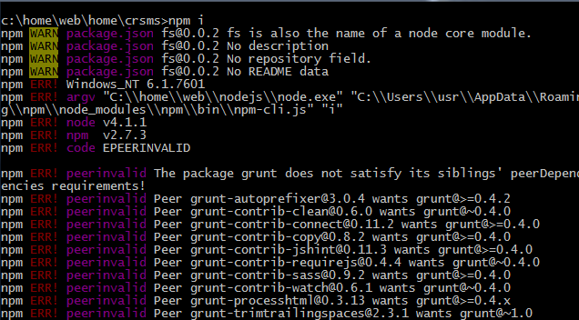
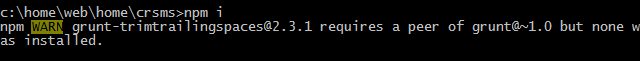

# Enviroment setting on Windows OS

##General scheme:
№ | What will be installed? | Notes
--- | --- | ---
1 | *ruby&sass* | Install ruby with ruby package manager gem for install sass via gem on the next step.
2 | node.js | Node package manager npm is installed automatically together with node.js. NPM is need to install all dependencies (grunt, json-server, lowdb etc) via package.json: npm install.
3 | grunt | Grunt is a collector for frontend developer (we install node.js+npm because we have choose use Grunt!)
4 | git | In such program environment Git is needed to work with bower and to team development generally.
5 | bower | For installing bower to be sure npm and git are installed.
6 | mongoDB | Database for BE

### 1. Install ruby&sass(scss)

1.1 Download [rubyinstaller] (http://rubyinstaller.org/downloads) and install (don’t forget about path!)

Check installation through Start Command Prompt with Ruby or any cmd:

	ruby -v

> Uninstall: via windows control panel

1.2 Install sass via ruby package manager gem:

	gem install sass

>*NOTE:* on Windows 7 may be error like
>
>`ERROR:  Could not find a valid gem 'sass' (>= 0), here is why:...`
>
>Fix:
>
>`gem sources -a http://rubygems.org/` then type `y` to confirm. Try again `gem install sass`

Check installation through any cmd:

	sass –v

> Uninstall: via cmd: gem uninstall sass

### 2. Install node.js&npm

2.1 Download [nodejs] (https://nodejs.org/en/download/) and install

2.2 Check installation through any cmd:

	node –v

 

> Uninstall: via windows control panel, then check and remove the next folders
>            C:\Program Files (x86)\Nodejs
>            C:\Program Files\Nodejs
>            C:\Users\{User}\AppData\Roaming\npm (or %appdata%\npm)
>            C:\Users\{User}\AppData\Roaming\npm-cache (or %appdata%\npm-cache)

### 3. Install Grunt (after install node.js!)

3.1 Install Grunt CLI (command line interface for cmd process command grunt)

   Install globally via cmd:

     npm install -g grunt-cli

   Check installation through any cmd:

     grunt --help

> Uninstall: via cmd: npm uninstall –g grunt

### 4. Install Git

4.1 Download [gitinstaller] (http://git-scm.com/download/win) and install (don’t forget about path!)

4.2 Config git:

	git config --global user.name "<YOUR NAME>"
	git config --global user.email "<YOUR EMAIL ADDRESS>"

### 5. Install bower (after install node.js and Git!)

5.1 Install globally via cmd:

	npm install -g bower

5.2 Check installation through any cmd:

	bower –v

> Attention!
> Check git path in environment variables: Computer -> Properties -> Additional system parameters -> Enviroment variables: >add something like C:\Program Files (x86)\Git\bin to system variables

### 6. MongoDB

6.1 Download [MongoDB] (http://www.mongodb.org/downloads) and install

6.2 Set up the MongoDB environment
https://docs.mongodb.com/getting-started/shell/tutorial/install-mongodb-on-windows/#run-mongodb-community-edition

`~path_to_mongo_db/mongod.exe --dbpath ~path_to_project_root\database\`
*NOTE:* create directory in project root database

### 7. NPM Install issues

In case of errors

Run `npm cache clean` and `npm update -g` to fix problems

